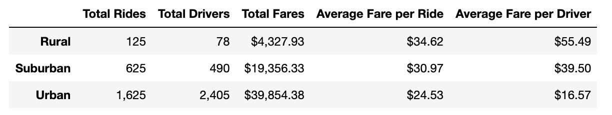
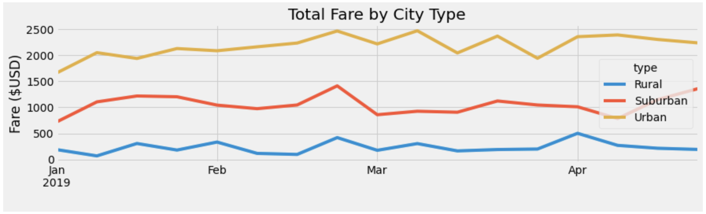

# PyBer_Analysis

---

## Overview

Using two files on ride-sharing data by city type, a summary data frame will be built to help determine how data differs by city type. With the help of Pandas and Matplotlib, a line chart will be created to visualise the data, and help determine how difference in city types can be used by decision-makers at PyBer.

--- 

## Results 

The summary data frame shows number of drivers, rider and fare information broken out by city type. 

 

PyBer Summary Data Frame

 

It's clear that urban cities have the most activity, with the highest number of riders, drivers and total fairs. Urban city drivers account for 81% of the total number of drivers, and 68% of the total number of rides taken. However, urban drivers receive a smaller fare compared to rural and suburban drivers. On average, urban drivers receive 29% less than their rural counterparts, and 21% less than their suburban counterparts. 

Though rural cities show the smallest number of rides, and have the smallest total fares compared to suburban and urban cities, the average fare per ride is the highest, at $34.62. Additionally, rural drivers have the highest average fare compared to their suburban and urban counterparts, at $55.49. 

 

PyBer Line Chart

 

---

## Summary
