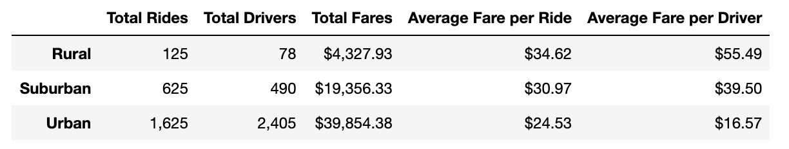
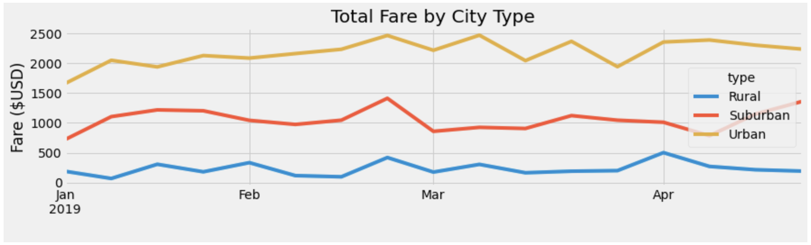

# PyBer_Analysis

---

## Overview

Using two files on ride-sharing data by city type, a summary data frame will be built to help determine how data differs by city type. With the help of Pandas and Matplotlib, a line chart will be created to visualise the data, and help determine how difference in city types can be used by decision-makers at PyBer.

--- 

## Results 

### Data Frame

The summary data frame shows the number of drivers, rider and fare information broken out by city type. 

 

PyBer Summary Data Frame

 

It's clear that urban cities have the most activity, with the highest number of riders, drivers and total fairs. Urban city drivers account for 81% of the total number of drivers, and 68% of the total number of rides taken. However, urban drivers receive a smaller fare compared to rural and suburban drivers. On average, urban drivers receive 29% less than their rural counterparts, and 21% less than their suburban counterparts. 

Though rural cities show the smallest number of rides, and have the smallest total fares compared to suburban and urban cities, the average fare per ride is the highest, at $34.62. Additionally, rural drivers have the highest average fare compared to their suburban and urban counterparts, at $55.49. 

### Line Chart

In addition to creating a data frame, a line chart can be made to visualise fare data over time.  

 

PyBer Line Chart

 

Though there is a large disparity in total fares by each city type, they all remain relatively consistent. 

Rural cities have the lowest total fares, and remained between $0 and $500. Urban cities had the highest total fares, but they saw a gradual increase in total fares between Jan and end of Feb, before seeing slight fluctuations through to April. All three city types saw a slight decline at the end of February. 

---

## Summary

Using the data collected above, three recommendations can be made for addressing any disparities among the city types. 

One disparity is the proportion of drivers to rides. In rural city types, there are 0.624 drivers for every ride, meaning each driver can provide 1.6 rides, and 0.784 drivers for every ride for suburban city types. In comparison, urban cities have 1.48 drivers for every ride, meaning each driver can provide 0.68 rides. 

The supply of drivers outweighs demand in urban cities, causing competition, and could be the cause of the lower average fares. One recommendation is to move urban drivers to suburban or rural areas, if there is a demand for it. As rural/suburban areas tend to have a smaller population than urban cities, it would also be recommended to examine further data to determine the correct number of drivers needed which won’t lead to unproductive labour. However, as the average fare for rides is higher in rural and suburban cities, another recommendation could be to reduce fairs in those areas to encourage this demand. 
